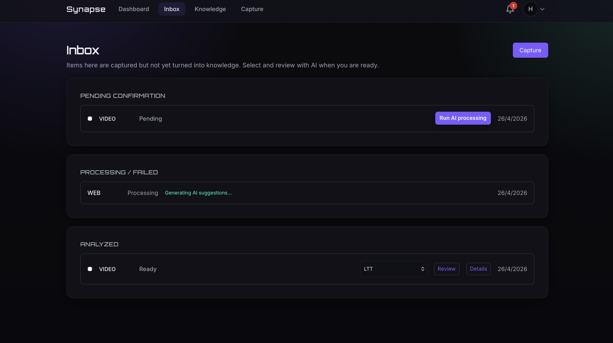

# Synapse

AI-powered digital brain to capture content, process it with local-first AI, and turn it into structured knowledge.

## Project Overview

Synapse helps teams and individuals move from raw captures (links, videos, text, documents) to actionable knowledge.  
It combines an inbox-first workflow, AI-assisted review, and knowledge organization (folders, tags, graph relations) with in-app notifications and export capabilities.

## Features

- Capture content from multiple sources (`VIDEO`, `WEB`, `AUDIO`, `DOCUMENT`, `TEXT`)
- Inbox workflow with explicit processing and status tracking
- AI preview + confirm flow (title, summary, tags)
- Knowledge hub with detail view, facets, graph, and folder assignment
- Scheduled reminders and notification center (read, clear, unread counter)
- User preferences for AI behavior, privacy/retention, localization, and exports
- Export knowledge as Markdown, JSON, or PDF

## Architecture

- **Backend**: modular Spring Boot monolith exposing `/api/*`
  - modules: `auth`, `user`, `content`, `inbox`, `processing`, `knowledge`, `notification`, `summary`, `ai`
- **Frontend**: feature-based React app
  - features: `auth`, `content`, `brain`, `notifications`, `profile`, `settings`
- **Data layer**: PostgreSQL + Flyway migrations
- **Security**: JWT-based authentication + protected APIs

Detailed architecture: [`docs/architecture.md`](docs/architecture.md)  
Detailed API docs: [`docs/api.md`](docs/api.md)

## Tech Stack

- **Backend**: Java 17, Spring Boot 3, Spring Security, Spring Data JPA, Flyway
- **Database**: PostgreSQL
- **AI**: Ollama (default local provider, model configurable)
- **Frontend**: React 18, TypeScript, Vite, React Query, Axios, Tailwind, i18next
- **Build/Dev**: Maven, npm, Docker Compose

## Setup Instructions

### 1) Prerequisites

- Java 17+
- Node.js 18+
- PostgreSQL 14+
- (Optional, recommended) Ollama running locally

### 2) Backend

```bash
cd backend
mvn spring-boot:run
```

Default API URL: `http://localhost:8080/api`

Important env vars:

- `POSTGRES_HOST`, `POSTGRES_PORT`, `POSTGRES_DB`, `POSTGRES_USER`, `POSTGRES_PASSWORD`
- `JWT_SECRET`
- `OLLAMA_URL`, `OLLAMA_MODEL`

### 3) Frontend

```bash
cd frontend
npm install
npm run dev
```

Frontend defaults to `http://<host>:8080/api` unless `VITE_API_URL` is defined.

### 4) Optional: local AI (Ollama)

```bash
ollama serve
ollama pull llama3
```

## Screenshots

Add product screenshots here (recommended names):

- `docs/screenshots/inbox.png`
- `docs/screenshots/ai-review.png`
- `docs/screenshots/knowledge-detail.png`
- `docs/screenshots/notifications.png`

Example markdown:

```md

```

## Roadmap

- Improve code-splitting and frontend bundle size optimization
- Expand provider abstraction beyond local Ollama defaults
- Add role-based access controls for multi-user/team scenarios
- Add observability dashboards (latency, queue health, AI pipeline metrics)
- Add CI quality gates for integration/e2e tests
