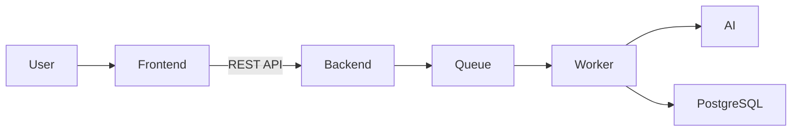

# Synapse

Synapse is an AI-powered knowledge processing system that transforms raw content into structured knowledge.

## Overview

Synapse captures links and text content, sends it through an asynchronous AI processing pipeline, and stores the result as structured knowledge items.

The platform separates capture from processing: users save first, process in background, review AI output, and persist validated knowledge. The resulting knowledge can be explored in list/detail views and in a neural graph to inspect relationships between ideas.

## Features

- Content capture from URLs or text
- Automatic AI summarization
- Tag and metadata extraction
- Asynchronous background processing
- Reliable job queue backed by PostgreSQL
- Knowledge persistence
- Interactive neural graph visualization
- Docker-based deployment
- REST API backend

## Demo


## Architecture



Additional technical documentation:
- [Architecture details](docs/architecture.md)
- [API reference](docs/api.md)
- [Domain model](docs/domain.md)
- [Deployment notes](docs/deployment.md)

## System Design

Synapse follows a layered architecture with a Spring Boot backend and a React frontend.  
The backend exposes stateless REST APIs for capture, processing, knowledge, notifications, and user settings.

Processing is asynchronous and database-backed: jobs are persisted in PostgreSQL and executed by worker logic outside the request/response path. Knowledge items, tags, folders, and relations are stored persistently and served through query-focused endpoints.

## AI Processing Pipeline

1. Capture content
2. Extract metadata
3. Generate summary
4. Extract tags
5. Store structured knowledge

## Reliability

- Jobs are stored in PostgreSQL
- Processing can continue after service restarts
- Retry behavior is handled in processing flows
- Queue state is persisted (not memory-only)
- Background processing is isolated from user-facing request latency

## Tech Stack

Backend:
- Java
- Spring Boot
- PostgreSQL

Frontend:
- React
- TypeScript

Infrastructure:
- Docker
- REST APIs

## Running the Project

### Prerequisites

- Java 17+
- Node.js 18+
- Docker + Docker Compose
- (Optional) Ollama for local AI execution

### Option A: Docker Compose

```bash
cp infra/.env.example infra/.env
docker compose -f infra/docker-compose.yml up --build
```

Access:
- Frontend: `http://localhost:5173`
- API: `http://localhost:8080/api`

### Option B: Run services manually

Backend:

```bash
cp .env.example .env.local
export JWT_SECRET='c3luYXBzZS1qd3Qtc2VjcmV0LWtleS0yNTYtYml0cy1mb3ItZGV2ZWxvcG1lbnQ='
cd backend
mvn spring-boot:run
```

Frontend:

```bash
cd frontend
npm install
npm run dev
```

Optional local AI:

```bash
ollama serve
ollama pull llama3
```

## Project Status

This project is under active development.

New features are being added continuously, and parts of the architecture are still evolving as the platform matures.

## Future Improvements

- Improved graph visualization and graph interaction controls
- More advanced search and discovery workflows
- Performance optimizations for larger datasets
- UX refinements across capture, inbox, and knowledge review flows
