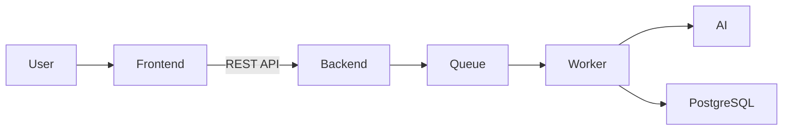

# Synapse

Synapse is an AI-powered knowledge processing system that transforms raw content into structured knowledge.

## Why Synapse?

Modern workflows generate large amounts of fragmented information across videos, articles, and notes.
Most tools store this information passively, making it difficult to revisit, connect, and reuse knowledge over time.

Synapse aims to transform raw content into structured, persistent knowledge that can be explored, organized, and connected.
Instead of simply storing information, Synapse focuses on building an active knowledge system — a reliable digital brain.

---

## Overview

Synapse captures links and text content, sends them through an asynchronous AI processing pipeline, and stores the result as structured knowledge items.

The platform separates capture from processing: users save first, process in the background, review AI output, and persist validated knowledge. The resulting knowledge can be explored in list/detail views and visualized in a neural graph to inspect relationships between ideas.

The system is designed around reliable asynchronous processing, ensuring that knowledge generation is resilient, recoverable, and independent from user request latency.

---

## Key Technical Highlights

* Asynchronous job processing using a database-backed queue
* Fault-tolerant processing pipeline with persistent job state
* Layered backend architecture with clear service boundaries
* Background workers isolated from request/response flows
* Horizontal scalability through coordinated worker execution
* Interactive knowledge graph visualization

---

## Features

* Content capture from URLs or text
* Automatic AI summarization
* Tag and metadata extraction
* Asynchronous background processing
* Reliable job queue backed by PostgreSQL
* Knowledge persistence
* Interactive neural graph visualization
* Docker-based deployment
* REST API backend

---

## Demo


\

---

## Architecture



Additional technical documentation:

* [Architecture details](docs/architecture.md)
* [API reference](docs/api.md)
* [Domain model](docs/domain.md)
* [Deployment notes](docs/deployment.md)

---

## System Design

Synapse follows a layered architecture with a Spring Boot backend and a React frontend.

The backend exposes stateless REST APIs for capture, processing, knowledge, notifications, and user settings. Each responsibility is separated into dedicated services to ensure maintainability and clear system boundaries.

Processing is asynchronous and database-backed: jobs are persisted in PostgreSQL and executed by worker logic outside the request/response path. This design allows the system to remain responsive while long-running AI tasks execute safely in the background.

The architecture supports horizontal scaling by running multiple worker instances that coordinate through database row locking.

Knowledge items, tags, folders, and relations are stored persistently and served through query-focused endpoints optimized for retrieval and exploration.

---

## AI Processing Pipeline

1. Capture content
2. Extract metadata
3. Generate summary
4. Extract tags
5. Store structured knowledge

This pipeline ensures that raw content is transformed into structured, searchable knowledge that can be explored and reused over time.

---

## Reliability

Synapse is designed to be resilient and fault-tolerant.

* Jobs are stored in PostgreSQL
* Processing can continue after service restarts
* Retry behavior is handled in processing flows
* Queue state is persisted (not memory-only)
* Background processing is isolated from user-facing request latency
* Workers can be restarted without losing processing state

This reliability model ensures consistent knowledge generation even in the presence of failures.

---

## System Boundaries

Synapse does not host AI models itself.
Instead, it integrates with local AI runtimes such as Ollama, allowing flexible model selection while keeping processing under user control.

The system is designed to remain provider-agnostic, enabling future integration with additional AI runtimes if required.

---

## Tech Stack

Backend:

* Java
* Spring Boot
* PostgreSQL

Frontend:

* React
* TypeScript

Infrastructure:

* Docker
* REST APIs

---

## Running the Project

### Prerequisites

* Java 17+
* Node.js 18+
* Docker + Docker Compose
* (Optional) Ollama for local AI execution

---

### Option A: Docker Compose

```bash
cp infra/.env.example infra/.env
docker compose -f infra/docker-compose.yml up --build
```

Access:

* Frontend: http://localhost:5173
* API: http://localhost:8080/api

---

### Option B: Run services manually

Backend:

```bash
cp .env.example .env.local
export JWT_SECRET='development-secret-key'
cd backend
mvn spring-boot:run
```

Frontend:

```bash
cd frontend
npm install
npm run dev
```

Optional local AI:

```bash
ollama serve
ollama pull llama3
```

---

## Project Status

This project is under active development.

New features are being added continuously, and parts of the architecture are still evolving as the platform matures.

The current focus is improving reliability, usability, and scalability of the knowledge processing workflow.

---

## Future Improvements

* Improved graph visualization and graph interaction controls
* Advanced search and discovery workflows
* Performance optimizations for larger datasets
* Enhanced retry and monitoring mechanisms
* UX refinements across capture, inbox, and knowledge review flows
* Improved error handling and system resilience across services
* Significant interface updates and usability improvements
* Introduction of a flashcards feature for knowledge reinforcement and learning workflows
* Increased test coverage across backend and frontend components
* Ongoing architectural and performance refinements


